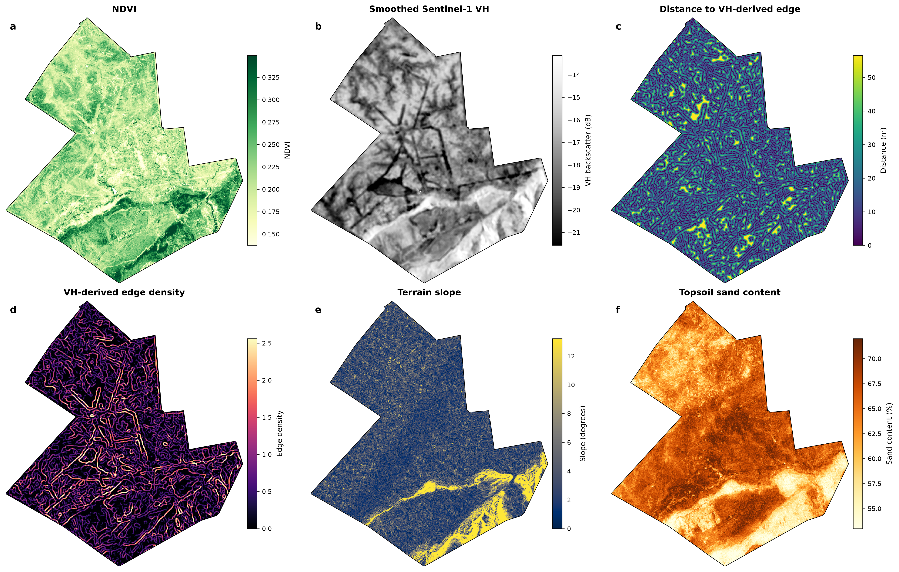
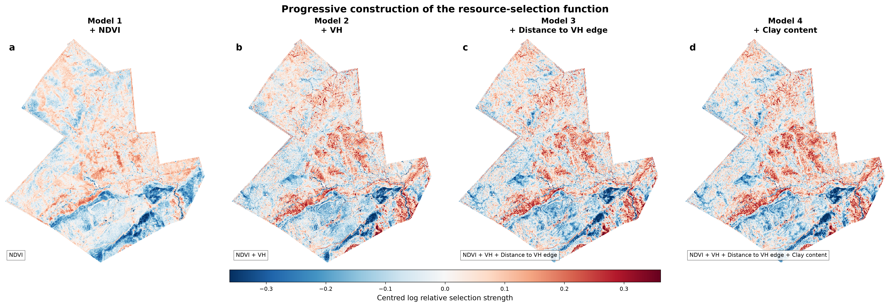
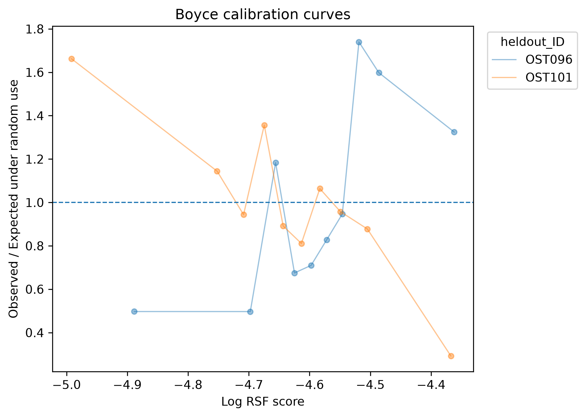
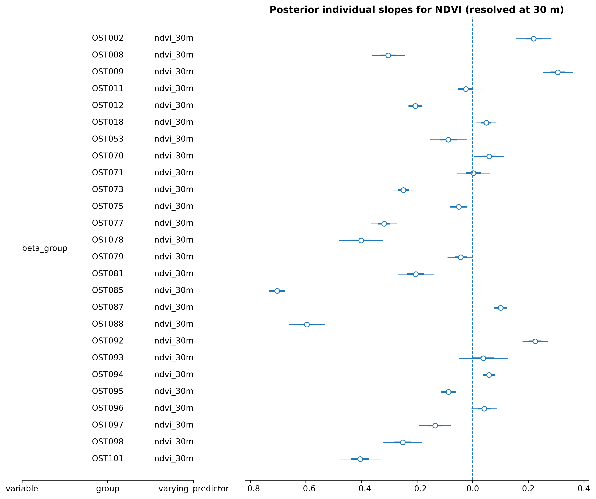
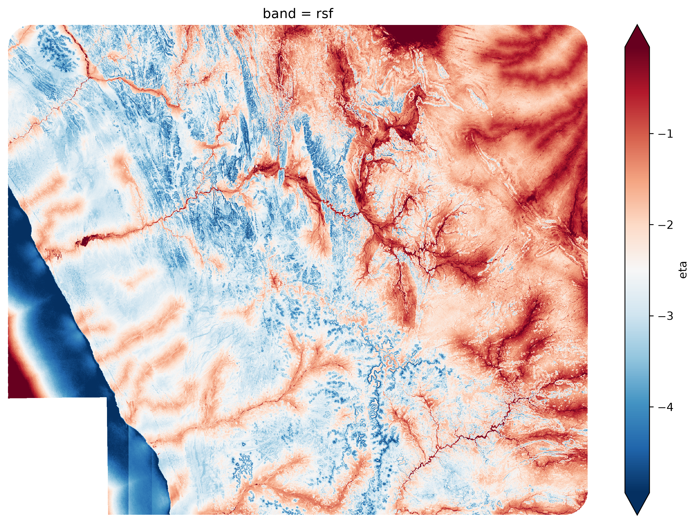
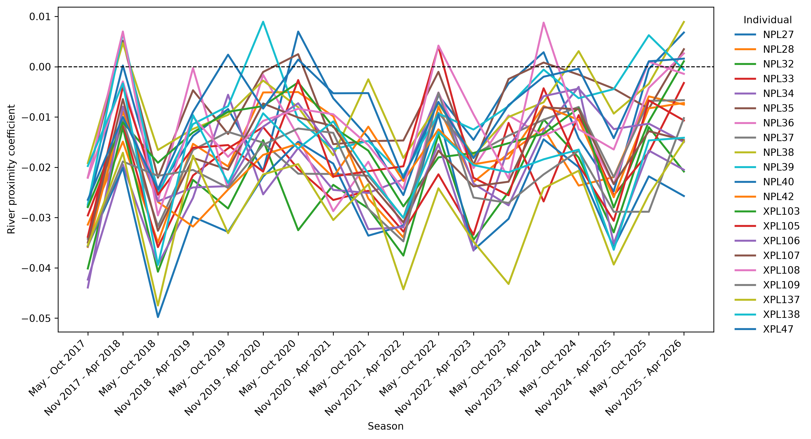

# Case Studies

## Static RSF (Pangolin)

### Challenge

Ground pangolins are among the most cryptic large mammals on Earth. As a consequence, surprisingly little is known about their habitat requirements, life history, or behavioural ecology. The few available telemetry studies are necessarily based on small sample sizes and geographically restricted populations, making it unclear whether their conclusions can be generalized across the species' vast distribution.

This uncertainty is of direct conservation relevance. Throughout much of their range, ground pangolins are threatened by intense poaching pressure and are likely to persist at viable densities only within well-managed reserves and sanctuaries. Identifying suitable areas for future protection therefore requires an accurate understanding of habitat selection. Failing to identify essential habitat features may render newly established reserves unsuitable; failing to account for individual variation may underestimate the ecological niche available to the species as a whole; and failing to quantify uncertainty risks overinterpreting stochastic patterns arising from telemetry error or remotely sensed environmental predictors.

Based on extensive field observations, we hypothesize that ground pangolins preferentially select habitat edges between dense bush and open grassland. Such ecotones may provide a favourable combination of prey abundance (ants and termites), suitable burrow locations, and immediate refuge from predators or disturbance. Indeed, disturbed pangolins are frequently observed retreating from open foraging areas into adjacent bush. If this hypothesis is correct, both heavily bush-encroached areas and recently cleared landscapes should represent comparatively poor habitat.

Testing this hypothesis requires translating the qualitative concept of an edge into quantitative environmental predictors suitable for a Resource Selection Function.

We analyse telemetry data from 26 ground pangolins collected between July 2024 and April 2026, comprising an average of 1,022 relocations per individual (range 589–2,008). The collars employ an above-ground detection algorithm (Kasko et al., in prep.), recording locations only while the animal is active outside its burrow. This results in approximately 5–6 relocations per day, corresponding closely to the average nightly activity period.

To quantify vegetation structure, we derived habitat metrics from Sentinel-1 Synthetic Aperture Radar (SAR) imagery. Edges were detected as abrupt spatial changes in the ratio between vertically and horizontally polarized backscatter. From these edge maps we calculated two predictors that we hypothesize to be ecologically meaningful for pangolins: distance to the nearest edge and edge density at multiple spatial scales. To illustrate Bayesian regularization and variable selection, we additionally included NDVI, terrain slope, and soil sand and clay content as candidate predictors.



### Frequentialist approach

We begin with a conventional Resource Selection Function fitted by maximum likelihood. As described in the previous chapters, this requires contrasting observed relocations with randomly sampled available locations drawn from each individual's availability domain.

First, we load the telemetry data

```python
from hsa.movement.geometry import prepare_trajectory_data
df = pd.read_csv("data/relocations/pango-large-subset.csv")
reloc = prepare_trajectory_data(df, geometry_col="geometry", source_crs = "EPSG:32733", target_crs = "EPSG:32733")
```

and the environmental predictor stack:
```python
from hsa.compute import open_raster_stack_zarr
from hsa.compute import suggest_xy_chunks
import xarray as xr
import rioxarray 

env = open_raster_stack_zarr("pangolin_predictor_stack.zarr")
env = env.chunk(suggest_xy_chunks(env, target_chunk_mb=256))
env = env.rio.write_crs("EPSG:32733")
```

Pseudoabsence locations are generated from the individual-specific availability domains before extracting environmental conditions for both used and available points:

```python
from hsa.sampling import get_availability_domain, sample_available_points, sample_raster_stack
domains = get_availability_domain(reloc, id_col="Individual_ID")
sampling = sample_available_points(domains, used = reloc, n_per_used = 50, id_col = "Individual_ID")
sampled = sample_raster_stack(sampling, env, id_cols="Individual_ID")
```

Subsequently, we can iteratively fit models and check coefficients as well as cv-performance:

```python
from hsa.features import FeatureSpec
from hsa.rsf import fit_rsf, predict_rsf_surface

specs = FeatureSpec(linear = ["ndvi_30m"])
model, scaler, spec, meta = fit_rsf(sampled, specs)
rsf = predict_rsf_surface(env, model, scaler, spec, meta)
rsf["exp"] = np.exp(rsf)
```

During model construction we observe that edge-related variables consistently improve predictive performance, whereas several additional environmental predictors contribute comparatively little:



Cross-validation suggests that the model performs well at the population level. However, examining validation statistics separately for each individual reveals an intriguing pattern.


Although the average Boyce Index indicates satisfactory predictive performance, several individuals exhibit substantial deviations from the population trend. Some are predicted remarkably well, whereas others display weak or even contradictory selection patterns. This observation raises an important biological question: are these merely noisy individuals, or do different pangolins genuinely respond differently to their environment?

A classical RSF cannot distinguish between these possibilities because it assumes a single regression coefficient for every individual. We therefore turn to a hierarchical Bayesian formulation.
### Bayesian approach

Hierarchical Bayesian models provide a natural extension of the classical Resource Selection Function by explicitly recognising that individuals need not respond identically to the same environmental conditions. Rather than estimating a single coefficient for each predictor, we estimate a population-level distribution from which individual-specific coefficients are drawn.

Mathematically, the linear predictor becomes

$$
\eta_i
=
\alpha_{j[i]}
+
\sum_{k=1}^{K}
\beta_{k,j[i]} x_{ik},
$$

where observation $i$ belongs to individual $j$.

Each individual regression coefficient is assumed to arise from a population-level distribution,

$$
\beta_{k,j}
\sim
\mathcal{N}\!\left(\mu_k,\sigma_k\right),
$$

where $\mu_k$ represents the average effect of predictor $k$ across the population, and $\sigma_k$ quantifies the extent of individual variation.

Similarly, the individual intercepts are modelled as

$$
\alpha_j
\sim
\mathcal{N}\!\left(\mu_\alpha,\sigma_\alpha\right).
$$

This formulation allows information to be shared across individuals through partial pooling, while still permitting genuine behavioural differences to emerge.

To reduce overfitting, we additionally employ a hierarchical regularized horseshoe prior, which automatically shrinks unsupported predictors towards zero while allowing important environmental variables to retain substantial effect sizes.

Fitting the model requires only replacing the estimation routine.

The resulting posterior distributions immediately reveal that the apparent lack of fit in the classical model was not simply statistical noise. Instead, individuals differ markedly in the strength—and occasionally even the direction—of habitat selection.




## Seasonally-Variant RSF (Lion)

## Challenge

Large African carnivores frequently exhibit strong associations with river systems. In semi-arid environments, rivers function as linear oases, supporting comparatively high primary productivity and consequently elevated prey densities. Yet the strength of this association is unlikely to remain constant throughout the year. Seasonal rainfall alters vegetation structure, prey distributions, and water availability, while prolonged drought may fundamentally reshape habitat selection.

We therefore ask how lion selection for riverine habitat changes throughout the annual cycle, and whether this seasonal trajectory differs between contrasting environmental conditions.

Using telemetry data from 21 lions, we fitted a Resource Selection Function.



To quantify these dynamics formally, we model the probability that relocation $j$ is used as

$$
y_j
\sim
\mathrm{Binomial}(n_j,p_j),
$$

with

$$
\mathrm{logit}(p_j)
=
\alpha_i
+
\beta_{i,s[j]}x^{\mathrm{river}}_j
+
\boldsymbol{\theta}^{\top}\mathbf{x}_j,
$$

where $x^{\mathrm{river}}_j$ denotes the standardized river predictor, $\mathbf{x}_j$ contains the remaining environmental covariates, observation $j$ belongs to individual $i$, and occurs during season $s[j]$.

Rather than estimating an independent river-selection coefficient for every season, we decompose the effect hierarchically as

$$
\beta_{i,s}
=
\mu_\beta
+
\gamma_{g[i]}
+
\delta_s
+
\kappa_{g[i],s}
+
b_i,
$$

where

- $\mu_\beta$ is the overall population mean,
- $\gamma_g$ is the effect of group $g$,
- $\delta_s$ represents the shared seasonal trajectory,
- $\kappa_{g,s}$ captures group-specific seasonal deviations, and
- $b_i \sim \mathcal{N}(0,\sigma_{\mathrm{individual}})$ represents persistent individual variation.

Consequently, the expected seasonal trajectory for each group becomes

$$
\beta_{g,s}
=
\mu_\beta
+
\gamma_g
+
\delta_s
+
\kappa_{g,s},
$$

while each individual follows

$$
\beta_{i,s}
=
\beta_{g[i],s}
+
b_i.
$$

The posterior trajectories clearly demonstrate that river selection is not static, but fluctuates predictably throughout the annual cycle. Moreover, the two ecological groups exhibit distinct seasonal responses, illustrating how hierarchical Bayesian models can simultaneously estimate population-level temporal trends while retaining persistent individual differences.




## Dynamic SSF (Vultures)
