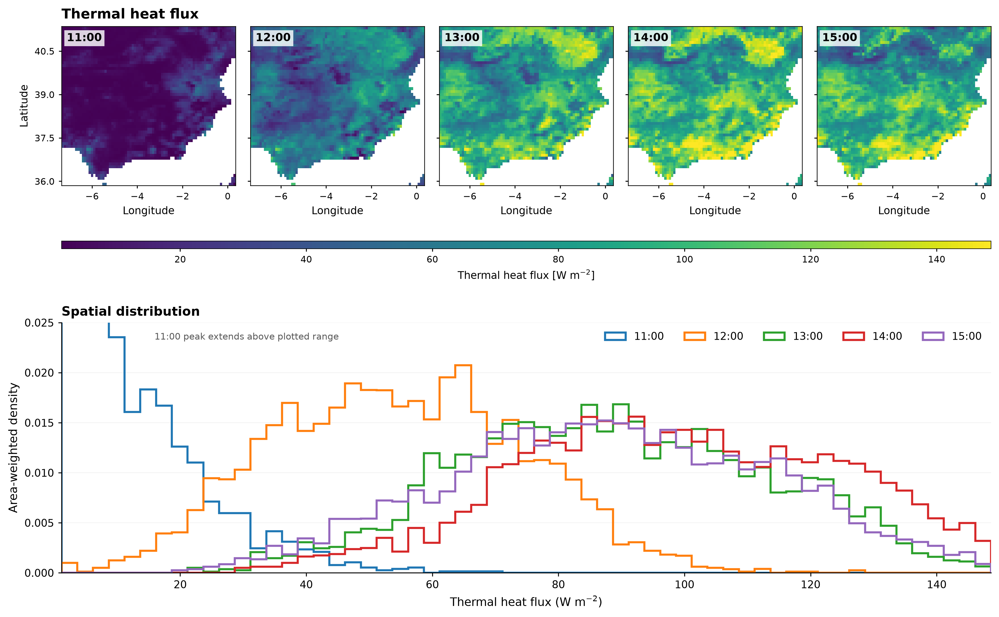
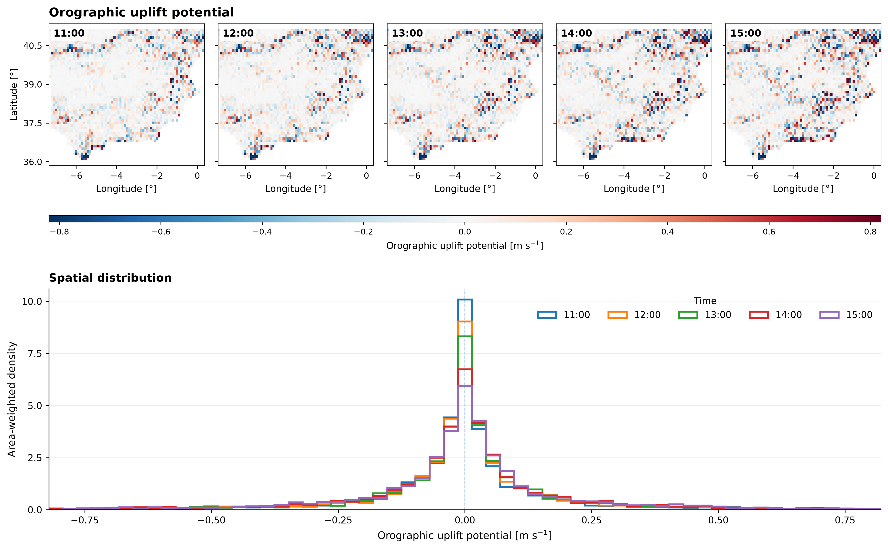
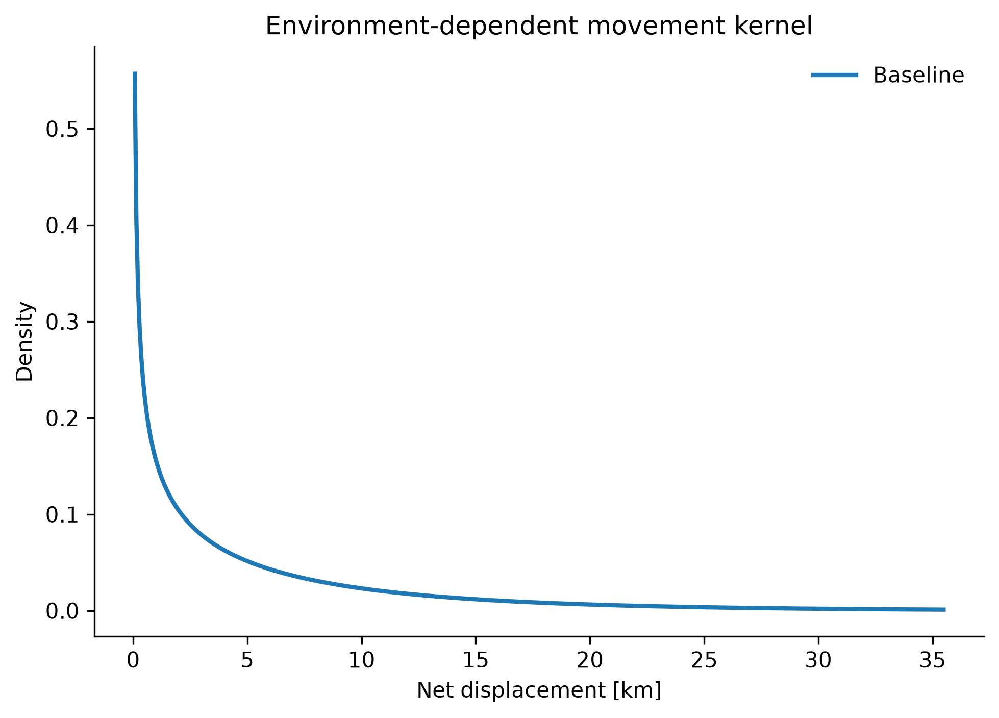
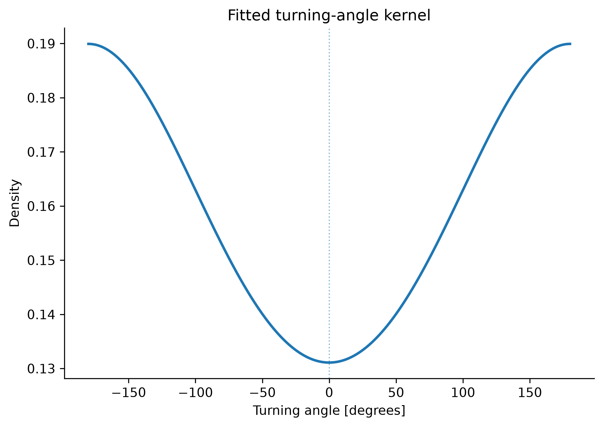
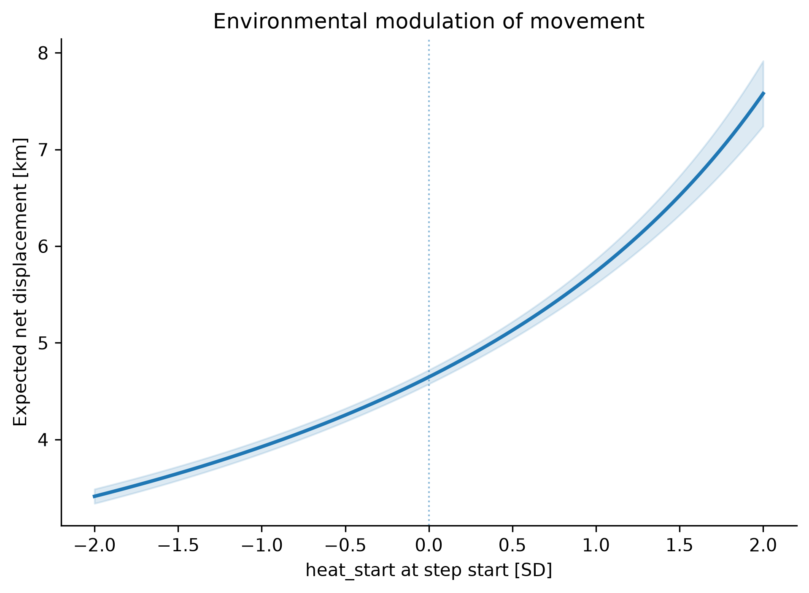
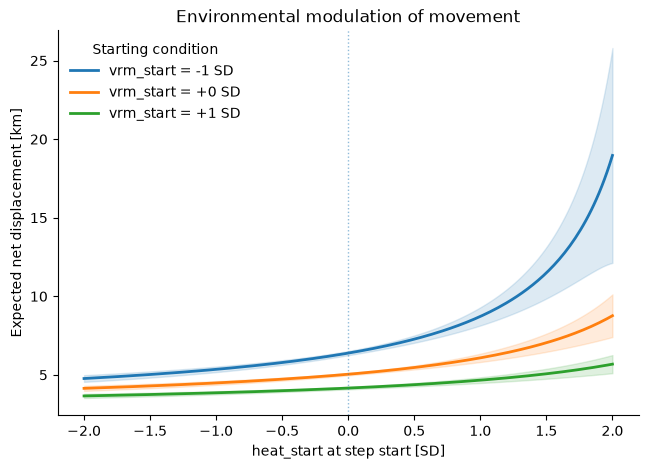

# Introduction

The goal of this exercise is to understand how dynamically varying atmospheric processes produce patterns of suitable conditions for soaring that bearded vultures use for energy-efficient soaring flight.

* Explanation of slope soaring and thermal soaring along the lines of Santos et al., 2017 (but do cite more literature!):
In general, overland soaring birds show stereotyped flight behaviour responses to uplift variation8–10. A critical energetic balance determines the use of soaring or flapping flight. Flapping is energetically costly, and birds use it more often when uplift conditions are not adequate11–13. Yet, flapping allows flying in a straight course towards the target, thus promoting faster progression than soaring14. Within inland soaring flight, two behavioural modes are commonly observed, slope soaring and thermal soaring15. Slope soaring is a response to orographic uplift that  forms when horizontal winds are deflected upwards by physical barriers, such as ridges or hills9, 16. Birds are able to gain altitude from the windward side of slopes but are also able to soar along ridges disposed linearly, such as mountain ranges17, 18. In comparison, thermal soaring is more commonly used in flat areas9, 17, but also occurs in steeper terrain19. Thermals are formed when low masses of air get in contact with solar exposed terrain, warm-up and rise to several hundreds of meters16. Thermals are normally scattered across the landscape, but they may align  densely in thermal streets20. Thermal soaring is typically divided in two phases, the circling phase where birds climb thermals in a circular ascending trajectory, and the gliding phase, where they achieve horizontal progression by descending in a linear trajectory20, 21.

* Progress in detecting updrafts:
The orographic uplift velocity (w0), caused by the interaction between horizontal wind at ground level and topography, was estimated as suggested by Bohrer et al.16 and Brandes and Ombalski59 from the following equations:  = ∗α  w v C (1)  0  = θ ∗ α−β  Cα Sin( ) Cos( ) (2)  where v is the horizontal wind speed (m s−1), Cα is the updraft coefficient, α is the horizontal wind direction at  ground level (in degrees, North = 0), β is the terrain aspect (in degrees, North = 0) and θ is the terrain slope angle (in degrees)

Explain ERA5 and the thermal flux upward

Plots for orographic and thermal upwind potential



We use data of 5 tagged bearded vultures to understand how they use this landscape of wind for efficient locomotion

# Model specifiction
Quick revision on how we progress from the RSF to SSF:

Plot for the step-selection

Explanation how we get to iSSF

Plot for movement kernel

# Walk-through

### Explain preparation
```Code
from hsa.movement import load_trajectory_data, prepare_trajectory_data
birds = load_trajectory_data(
    "data/vector/birds",
    individuals=[
        "BG1018_Kika",
        "BG1036_Huesitos",
        "BG1049_Stelvio 50",
        "BG1053_Bwindi",
        "BG1057_Curro",
    ],
)

reloc = prepare_trajectory_data(
    birds,
    id_col="individual-local-identifier",
    timestamp_col="timestamp",
    lon_col="location-long",
    lat_col="location-lat",
    source_crs="EPSG:4326",
    target_crs="EPSG:2062",
)

env = xr.open_zarr(
    "data/raster/vultures_terrain-SPAIN-2062.zarr",
    decode_coords="all",
)

era5 = xr.open_dataset(
    "https://api.earthdatahub.destine.eu/era5/era5-land-v0.zarr",
    storage_options={"client_kwargs":{"trust_env":True}},
    chunks={},
    engine="zarr",
)

def era5_land_hourly_increment(da, *, time_name="valid_time"):
    previous = da.shift({time_name: 1})
    increment = da - previous
    hour = da[time_name].dt.hour
    return xr.where(hour == 1, da, increment)

H = (-era5_land_hourly_increment(era5["sshf"]) / 3600.0).rename("sensible_heat_flux_upward")

met = xr.Dataset(
    {
        "sensible_heat_flux_upward": H,
        "skin_temperature": era5["skt"],
        "air_temperature_2m": era5["t2m"],
        "dewpoint_temperature_2m": era5["d2m"],

        "wind_u_10m": era5["u10"],
        "wind_v_10m": era5["v10"],
    }
)

met["surface_air_temperature_excess"] = met["skin_temperature"]- met["air_temperature_2m"]
met["dewpoint_depression"] = met["air_temperature_2m"] - met["dewpoint_temperature_2m"]

met["wind_speed_10m"] = np.hypot(
    met["wind_u_10m"],
    met["wind_v_10m"],
)
```

Explain the differences between endpoint, startpoint, and directional predictors. 

##### Naive model

```Code
selection = ['elevation', 'slope', 'vrm_2070m', 'tpi_2070m', 'heat', 'orographic_uplift']

issf.set_model(
    selection=selection,
    movement=False,
    proposal_correction=False,
)

design_naive = issf.prepare_design()

fit_naive = issf.fit(
    engine="fast",
    method="lbfgs",
    maxiter=1000,
)

fit_naive.summary()
```

```Code
coef	std err	z	P>|z|	[0.025	0.975]
predictor						
elevation_z	0.850892	0.010755	79.119451	0.000000e+00	0.829814	0.871971
slope_z	0.680950	0.004183	162.792066	0.000000e+00	0.672752	0.689148
vrm_2070m_z	0.242714	0.004802	50.544588	0.000000e+00	0.233302	0.252126
tpi_2070m_z	0.073617	0.003746	19.654362	5.305203e-86	0.066276	0.080959
heat_z	0.318207	0.070752	4.497491	6.876017e-06	0.179536	0.456879
orographic_uplift_z	0.006980	0.003031	2.303094	2.127354e-02	0.001040	0.012920
```
Write interpretation

##### Correction
```Code
issf.set_model(
    selection=selection,
    movement=False,
    proposal_correction=True,
)

design_corrected = issf.prepare_design()

fit_corrected = issf.fit(
    engine="fast",
    method="lbfgs",
    maxiter=1000,
)

fit_corrected.summary()
```

```Code

coef	std err	z	P>|z|	[0.025	0.975]
predictor						
elevation_z	1.720982	0.008663	198.658504	0.000000e+00	1.704002	1.737961
slope_z	1.242974	0.004850	256.274696	0.000000e+00	1.233468	1.252480
vrm_2070m_z	0.440548	0.004997	88.166969	0.000000e+00	0.430755	0.450342
tpi_2070m_z	0.048120	0.004205	11.443459	2.535700e-30	0.039878	0.056361
heat_z	0.491149	0.042783	11.479917	1.664397e-30	0.407296	0.575003
orographic_uplift_z	0.008188	0.003288	2.489867	1.277911e-02	0.001743	0.014633

```


##### Basic Movement terms
```Code
# Towards movement 
issf.set_model(
    selection=selection,
    movement="default",
    proposal_correction=True,
)

design_movement = issf.prepare_design()

fit_movement = issf.fit(
    engine="fast",
    method="lbfgs",
    maxiter=1000,
)

fit_movement.summary()
```

```Code
coef	std err	z	P>|z|	[0.025	0.975]
predictor						
elevation_z	0.936214	0.009720	96.319023	0.000000e+00	0.917163	0.955265
slope_z	0.757600	0.004313	175.665957	0.000000e+00	0.749147	0.766053
vrm_2070m_z	0.261635	0.004642	56.362907	0.000000e+00	0.252537	0.270733
tpi_2070m_z	0.070649	0.003719	18.998458	1.756278e-80	0.063360	0.077937
heat_z	0.390129	0.062215	6.270698	3.594339e-10	0.268191	0.512067
orographic_uplift_z	0.007454	0.002955	2.522431	1.165467e-02	0.001662	0.013246
step_length_km	-0.097927	0.000936	-104.654748	0.000000e+00	-0.099761	-0.096093
log_step_length	-0.446648	0.002164	-206.381273	0.000000e+00	-0.450890	-0.442407
cos_turn_angle	-0.185372	0.005251	-35.299044	6.074170e-273	-0.195665	-0.175079
```




##### Interaction with the movement distribution

```Code
issf.set_model(
    selection=[
        "elevation",
        "slope",
        "orographic_uplift",
    ],

    movement="default",

    modifiers={

        "elevation_start": [
            "step_length",
            "turning",
        ],

        "vrm_2070m_start": [
            "step_length",
            "turning",
        ],

        "tpi_2070m_start": [
            "step_length",
            "turning",
        ],

        "heat_start": [
            "step_length",
            "turning",
        ],

        "orographic_uplift": [
            "step_length",
            "turning",
        ],
    },

    proposal_correction=True,
)

fit_full = issf.fit(
    engine="fast",
    method="lbfgs",
    maxiter=1500,
)

fit_full.summary()
```


Plots to include:





#### Show movement towards Bayesian
´´´Code
bayes = issf.to_bayesian(
    model_kwargs={
        "mu_sigma": 1.0,
        "heterogeneity_sigma": 0.35,
    }
)

bayes_design = bayes.prepare_design(
    scaling=design.scaling,
)

fit_bayes = bayes_pilot.fit(
    scaling=design.scaling,

    sample_kwargs={
        "draws": 500,
        "tune": 100,
        "chains": 4,
        "target_accept": 0.95,
        "nuts_sampler": "blackjax"
    },
)
´´´

Explore interaction between predictors:


Explore individual differences:
