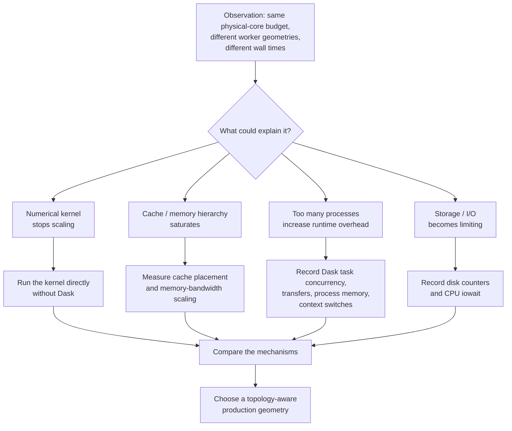
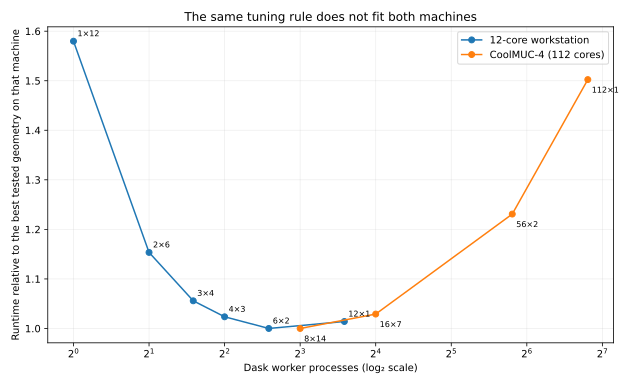
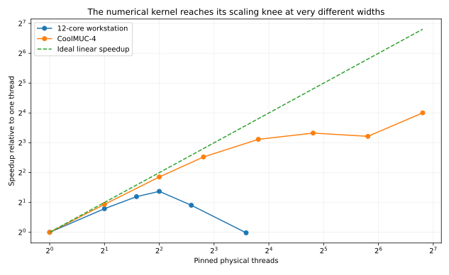
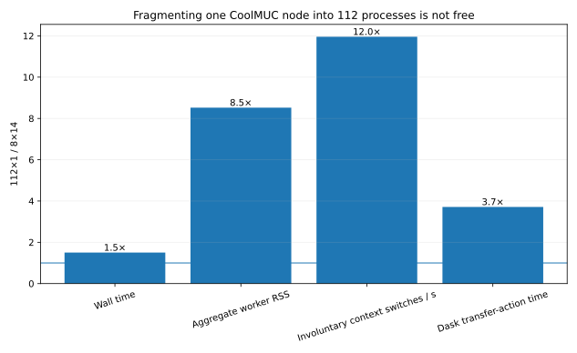
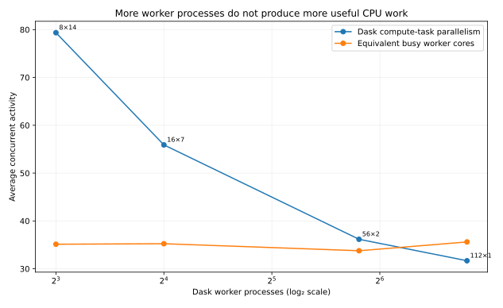

# From core count to execution geometry

## How hrHSA learned that “use all cores” is not a complete performance strategy

Parallel software is often described in terms of a single number: **how many cores does the machine have?**  
Our benchmarking of hrHSA on a 12-core workstation and on a 112-core CoolMUC-4 node showed why that number is not enough.

Both machines could expose all of their physical cores to the same raster-prediction workload. Yet the fastest way to organize those cores was almost the opposite:

| | 12-core workstation | CoolMUC-4 node |
| --- | --- | --- |
| Physical cores | 12 | 112 |
| Important topology | 4 small L3/cache domains | 2 sockets × 56 physical cores |
| Direct-kernel scaling knee | about 3–4 threads | about 14–28 threads before strong diminishing returns |
| A single process using the whole node | poor at `1×12` | direct numerical kernel still scales strongly to 112 threads |
| Preferred Dask region observed so far | `12×1`, `6×2`, `4×3` | `8×14`, with `16×7` close behind |
| What becomes expensive first | shared-cache / locality pressure | process fragmentation and orchestration, on top of memory saturation |
| Practical lesson | many relatively narrow workers | fewer, wider workers |

Here `8×14` means **8 Dask worker processes with 14 execution threads each**. Both `8×14` and `112×1` therefore use the same nominal budget of 112 physical cores. The difference is how that budget is divided between processes and threads.

The important result is not that one geometry won a benchmark. It is that **machine architecture changes what “good parallelism” looks like**.

---

## The inference route

We did not begin with an assumption that `8×14` should be fast. The execution policy emerged through a sequence of increasingly targeted experiments.



This distinction matters. A benchmark tells us **what was fastest**. A mechanism experiment asks **why**.

---

# Part I — the workstation taught us to respect cache topology

The first detailed investigation used a 12-core AMD Ryzen 9 3900X workstation. Its physical cores are divided across four small L3/cache domains.

When we removed Dask and timed only the reusable-workspace NumPy prediction kernel, scaling was initially excellent:

- 1 thread: 1.452 s
- 2 threads: 0.839 s
- 3 threads: 0.634 s
- **4 threads: 0.561 s**
- 6 threads: 0.775 s
- 12 threads: 1.469 s

The numerical kernel therefore did **not** want one 12-thread process. It reached its best point around four threads and then became slower.

A separate placement experiment made the cache effect much harder to dismiss. Four threads placed compactly on neighboring cores were substantially slower than four threads spread across the independent L3 domains; spreading the threads improved throughput by roughly 27%. With three threads, the improvement was roughly 34%.

The workstation therefore taught us an important lesson:

> More threads inside one process can be worse than several smaller workers when those threads compete within the same shared-cache hierarchy.

This is why the full Dask workload performed well with geometries such as `12×1`, `6×2`, and `4×3`, whereas `1×12` was much less attractive.



The plot is normalized **within each machine**. It is not a cross-machine speed comparison; the workloads and hardware differ. It shows the shape of the geometry preference.

On the workstation, moving from one very wide worker toward several narrower workers helps. On CoolMUC-4, moving too far toward one process per core hurts.

---

# Part II — CoolMUC-4 looked almost like the mirror image

CoolMUC-4 has a very different architecture: 112 physical cores per node, arranged across two 56-core sockets, with far more memory bandwidth and a much larger shared-memory system.

Our first fixed-112-core geometry experiments showed a reproducible ranking. In the mechanism run, median wall times were approximately:

| Geometry | Median wall time | Relative to `8×14` |
| --- | ---: | ---: |
| **`8×14`** | **10.37 s** | **1.00×** |
| `16×7` | 10.67 s | 1.03× |
| `56×2` | 12.77 s | 1.23× |
| `112×1` | 15.58 s | 1.50× |

Every configuration used the same 112 physical cores, and strict topology validation confirmed the expected physical-core allocation.

That immediately ruled out the simplest explanation:

> The slowdown cannot be explained by “using fewer cores”, because the core budget is unchanged.

But it still left several possibilities. Perhaps the numerical kernel itself could not scale to a full node. Perhaps memory bandwidth saturated. Perhaps Dask process overhead grew with worker count. We therefore removed layers one at a time.

---

## The direct numerical kernel behaved very differently from the workstation

The same reusable-workspace kernel was run directly, with one executor thread pinned to each selected physical CPU.



The architectural contrast is striking.

On the workstation, the direct kernel reaches its best point around four threads and then loses performance as the whole 12-core chip is engaged.

On CoolMUC-4, the direct kernel scales far deeper into the machine. Relative to one thread, the measured speedups were approximately:

- 2 threads: 1.9×
- 4 threads: 3.6×
- 7 threads: 5.8×
- 14 threads: 8.7×
- 28 threads: 10.0×
- 56 threads: 9.3×
- 112 threads: 16.0×

The 28→56 plateau is consistent with shared-memory resources becoming saturated within part of the node. The large increase at 112 threads is likewise consistent with engaging more of the full two-socket memory and execution hierarchy.

Most importantly, the result tells us what **did not** cause the slow `112×1` production result:

> The numerical kernel is capable of using a much wider CoolMUC node. The poor `112×1` result is therefore not simply “the kernel cannot use 112 cores”.

That pushes the inference upward, toward the execution runtime.

---

# Part III — the Dask telemetry exposed the cost of process fragmentation

The most useful CoolMUC experiment kept the physical-core budget fixed and recorded low-overhead runtime telemetry while changing only the process/thread geometry.

The contrast between `8×14` and `112×1` is especially clean:

| Quantity | `8×14` | `112×1` | Change |
| --- | ---: | ---: | ---: |
| Physical cores | 112 | 112 | same |
| Median wall time | 10.37 s | 15.58 s | **1.50×** |
| Aggregate worker RSS | ~4.3 GiB | ~36.5 GiB | **~8.5×** |
| Involuntary worker context switches / s | ~142 | ~1,702 | **~12×** |
| Summed Dask transfer-action time* | ~6.8 s | ~25.3 s | **~3.7×** |
| Dask compute-task parallelism* | ~79 | ~32 | **~40% retained** |
| Equivalent busy worker cores | ~35 | ~36 | essentially unchanged |

\* Task-stream quantities use the captured repetitions; the first repeat of the exploratory `cm4_inter` run did not contain task-stream events.



The important pattern is that **process count rises dramatically without producing more useful CPU work**.

At `112×1`, the runtime maintains 112 Python/Dask worker processes instead of eight. Process memory rises, involuntary scheduling activity rises, and Dask spends more aggregate time transferring data. Yet the workers collectively accumulate CPU time equivalent to only about the same 35–36 continuously busy cores.



This is the result that turns a performance observation into a mechanism hypothesis.

If `112×1` were slow because its individual calculations were intrinsically slower, we would expect the numerical kernel itself to collapse. It does not.

If `112×1` were slow because we simply lacked CPU resources, we would expect useful CPU occupancy to rise as we created more workers. It does not.

Instead, the extra processes mostly add **runtime state and coordination cost**.

---

# Why the two machines prefer different geometries

The workstation and CoolMUC-4 therefore tell the same general story but at different architectural scales.

### Workstation

The useful threaded unit is small. Shared-cache locality becomes important quickly, and a single 12-thread kernel performs poorly. Dividing the work across multiple narrow workers lets independent pieces of the chip make progress without forcing one operation through the entire shared hierarchy.

Conceptually:

```text
12 physical cores
      │
 ┌────┼────┬────┐
 L3   L3   L3   L3
 3c   3c   3c   3c

small useful threaded unit
        ↓
several narrow workers
```

### CoolMUC-4

The useful threaded unit is much wider. The numerical kernel can profitably exploit many cores within a process before shared-memory effects dominate. Creating a Python process for every core therefore gives away much of that advantage by multiplying process state and orchestration.

Conceptually:

```text
112 physical cores
        │
  ┌─────┴─────┐
socket 0    socket 1
56 cores     56 cores

wide useful threaded unit
        ↓
fewer, wider workers
```

The common principle is more interesting than either optimum:

> **Choose worker width near the point where intraprocess scaling is still efficient, before shared-memory contention becomes severe; then use enough worker processes to cover the machine without needlessly multiplying runtime overhead.**

For the Ryzen workstation, that point is only a few cores wide.  
For the tested CoolMUC-4 workload, it is much wider.

---

# What this means for hrHSA

The result argues strongly against a universal rule such as:

```text
one worker per physical core
```

or:

```text
one process for the entire machine
```

Both extremes can be wrong.

A more robust execution policy needs to consider at least:

1. **physical topology** — sockets, physical cores, SMT siblings, and shared-cache domains;
2. **the scaling width of the numerical kernel**;
3. **memory-bandwidth saturation**;
4. **the cost of multiplying Python/Dask worker processes**;
5. **task size and task density**.

This is why hrHSA now treats worker geometry as a first-class execution decision rather than deriving it from the raw CPU count alone.

The longer-term direction is clear: topology supplies the safe search space, and a small calibration benchmark can identify the high-performance region for a new machine.

---

# What we can say now — and what remains provisional

The workstation mechanism story is comparatively mature: direct-kernel scaling, cache-domain placement, reusable-workspace measurements, and hardware counters all point toward an early cache/locality ceiling.

The CoolMUC result is already strong enough to show that process-heavy Dask layouts are costly on the tested one-node workload. However, the present mechanism run was performed on **`cm4_inter`**, and should remain labelled as diagnostic evidence rather than a final production benchmark.

The revised `cm4_std` campaign is intended to close the remaining gaps. In particular it adds the complete fixed-core geometry sequence:

```text
1×112 → 2×56 → 4×28 → 8×14 → 16×7 → 28×4 → 56×2 → 112×1
```

The `1×112` ↔ `112×1` comparison is especially valuable: both configurations use the same 112 physical cores, but one uses a single wide worker while the other uses 112 one-thread workers.

The revised run also records Dask scheduler-process telemetry and uses stricter thread-owned first-touch semantics for the memory-bandwidth diagnostic. Hardware `perf` counters remain best-effort on the LRZ system.

Until that production confirmation is complete, the public interpretation should therefore be:

> **On the tested one-node CoolMUC-4 diagnostic workload, `8×14` is the preferred observed geometry, and the evidence strongly associates the degradation toward `112×1` with process/runtime fragmentation rather than with an inability of the numerical kernel to exploit the node.**

That wording preserves the evidence without pretending that one experiment establishes a universal law.

---

## Reproducibility

The public figures on this page summarize the benchmark campaigns; they are not substitutes for the raw records.

The full discovery path — including failed topology diagnostics, warmed versus cold runs, raw JSONL observations, task-stream telemetry, and the later `cm4_std` confirmation — is reconstructed in:

```text
benchmarking/hpc/analysis/coolmuc4_performance_discovery.ipynb
```

The benchmark protocol is documented separately in:

```text
docs/publication-benchmark.md
```

For cross-machine comparisons, normalized trends are used rather than raw wall times because the machines, workloads, and campaign contexts differ. `cm4_inter` and `cm4_std` measurements are kept explicitly separate.

---

## The short version

A physical core count tells us **how much hardware is available**.

It does not tell us **how software should be divided across it**.

The workstation taught us that too many threads inside one process can overwhelm a small shared-cache hierarchy. CoolMUC-4 taught us that too many processes can overwhelm the runtime even when far more threaded parallelism remains available.

That is why the fastest configurations look different — and why topology-aware benchmarking is part of the algorithm, not merely an afterthought.
